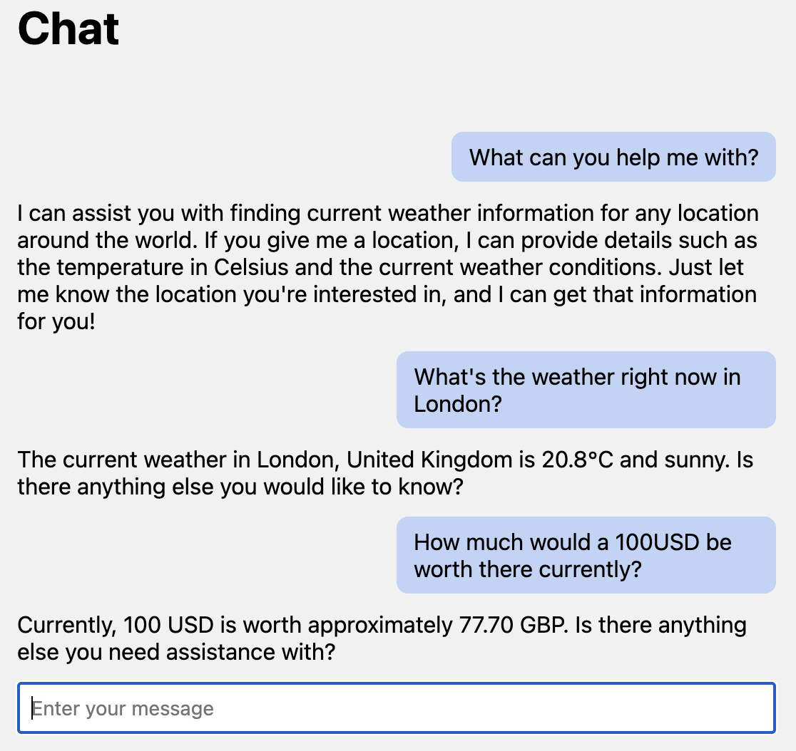

# multi-agent-ai
Some experimentation with the different multi-agent AI orchestration frameworks currently widely used.

Here are some of the ways to run this: After installing Poetry on your system, run `poetry install` to install all the pre-requisites. After that `poetry run python weather_app.py` will give you a local ip where the page is hosted and you can interact with the chatbot.

